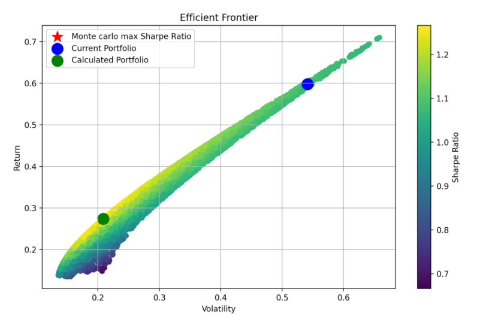

# MS Mini Project

Below is a description of what I have done and some quick back-of-the-envelope findings. Most effort was spent on building the analytical frameworks, not on front-end presentations or drawing conclusions.

## How to Run the Dashboard

To run the dashboard, use the following commands in your terminal:

```bash
pip install -r requirements.txt
streamlit run main.py
```

## Code Structure

The project structure is as follows:

```
├── README.md
├── main.py
├── requirements.txt
└── dashboard.py
```

- `main.py` is the front-end UI.
- `dashboard.py` handles the backend calculations and functions.

## Tasks Received

Let’s say you have a portfolio consisting of 3 positions: £10k in TSLA, £80k in SPX, and £10k in Gold based on your macro view.

Could you generate a dashboard in Python that monitors the current levels, 5Y min/max, and daily, weekly, and monthly movements of each position?

How would you measure the relative cheapness/expensiveness of each position?  
How would you measure the scale of each position’s moves with a quantitative measure?  
How would you measure the sensitivity of your stock portfolio to rates?  
What would be a good hedge for your portfolio? How would you measure its historical effectiveness (backtest)?

Please include your findings and output in a write-up and attach the code you used to generate the charts and results.

## High-Level Findings

- TSLA is relatively rich compared to its peers based on PCA residuals (so are SPX and gold)and fundamental financial ratios.
- SPX has been outperforming since late summer repricing.
- Gold is rich and closely tracking with platinum.
- Gold miners are cheapening, indicating potential future gold price decrease, based on historical correlation.
- SPX and UK equities have shown varying performance trends throughout the year, using 1y horizon.
- Gold and gold miners show negative correlation on longer horizons for their relative rich and cheapness.
- TSLA offers the highest risk-adjusted return over a 5-year horizon, but gold offers the highest risk adjusted return in 1-y horizon.
- TSLA has significantly higher VaR compared to Gold and SPX and it is aorund 4 times more volatile than SPX and gold.
- Equity sensitivity to rates varies, with TSLA showing surprising sensitivity to front-end rates, and SPX and gold are very sensitive to 10y sector.
- Optimal portfolio allocation currently overweights SPX and underweights TSLA and Gold.
- Treasuries are the most effective hedge, while Silver, NASDAQ and Exxon Mobil are the least effective. Given the high correlation between silver & gold, NASDAQ & TSLA, it makes sense for them to perform poorly.
- Hedged portfolios may have higher VaR but show increased percentage of positive days and longer right tails which are desirable features for a portfolio.


## Home

The home page plots the price of the security in a basic way. The left-side panel offers some basic settings for users to explore. The dials plot the price max and min and allow the user to see the current price compared to the selected time horizon. The purple band will highlight the range over the past month.

Market value plots display the position (i.e., price given the amount invested). There are metrics for the position value change, PnL, and annualised return.

The time series data plot and combined time series plot ignore the position size and simply study the underlying security performance. It also includes features to view the positions in a normalised way, as some securities may have much larger volatility than others. More than two securities must be selected for the plot.

Data used is available for download at the bottom.

> **Note:** When plotting on a normalised scale, Tesla dwarfs the other 2 positions. Expect TSLA to contribute most of the vol.

### Dashboard demos

*Homepage dialas showing price movements*

*Homepage plots showing price movements*

## Relative Value Analysis

Relative Value (RV) analysis looks at PCA residuals to understand the relative cheapness/richness compared to the market price movement of comparable assets. For individual securities, fundamental analysis is also included, though it was not the main focus.

Comparables companies are used to analyse the underlying stock, other major indices are used to analyse SPX and other precious metals and mining companies are used to analyse Gold. 

Price data is first normalised and scaled. Eigendecomposition is performed on the variance-covariance matrix of the data, and eigenvectors are used to project the original data to a new coordinate system to form PCA-implied data. The difference between PCA-implied data and the original data is the PCA residual. To visualise, Z-scores are calculated to form a normalised comparison.

Three principal components (PCs) are typically sufficient for this transformation.

In the validity check section, we verify that the three PCs provide enough explanatory power for the variance of the original data to ensure the following analysis is valid.

Residuals are calculated as:

`Residuals = scaled data - reconstructed data`

and hence, a high residual implies the position is rich relative to its peers.

For equities, P/E and PEG ratios can be insightful for fundamental analysis, and for gold, we could look at the Gold/Silver ratio and price-to-mining-cost ratios.


Data used is available for download at the bottom.

> **Note:** TSLA is very rich when compared against other MAGs based on the PCA implied price movement in the past 5y (second to NVDA), but less rich on the 1y horizon. Surprisingly TSLA is richer than NVDA on 1y scale. On fundamental analysis, TSLA actually has the highest P/E when compared with other comps, more than NVDA. SPX has been outperforming since its late summer repricing, and UK equities were outperforming early in the year before entering equilibrium. Gold is still rich and has been tracking closely with platinum. Gold miners are cheapening, and we saw some delayed effect in gold miner performances and hence could expect gold to cheapen slightly going forward. On longer horizon gold miners & silver, and gold performances appear to be negatively correlated on PCA residual.  
### Dashboard demos

*plots showing PCA implied position richness and cheapness*

*fundamental analysis for single name equities*


## Volatility Analysis

The first plot displays the daily percentage change in data. The **Risk Threshold** in the settings bar allows users to set an arbitrary risk tolerance level, highlighting days where percentage up or down exceeds the risk threshold. Volatility data returns some basic volatility statistics, risk measures, and some risk-reward trade-offs. VaR analysis incorporates some risk scenario analysis, with adjustable confidence intervals in the settings panel.

A histogram of daily price changes is also plotted to study the distribution; ideally, we want a longer right tail. The volatility bar plot examines the change in annualised volatility. Based on the holding period, theoretically, holding a position longer should reduce annualised volatility. The plot shows data for the last 30 days rather than the mean over the whole period.

Rolling volatility is calculated on a 30-day rolling basis, and the rolling Sharpe ratio is calculated on the geometric mean return basis.

No dataframe is available for download because no new dataframes were created.

> **Note:** Gold has the lowest vol and TSLA has the highest. But still, on a 5y horizon, TSLA offered the highest risk-adjusted return, but TSLA has significantly higher VaR of 6% at a 95% confidence interval vs the 2% for Gold and SPX. On average, volatilities will halve when a position is held from 1 week to 1 month, and halve again from 1 month to 1y.
### Dashboard demos

*daily price movements and volitility measures*

*sample distributions and volitility change for different holding periods*

## Rates Analysis

There is a common view that equity is negatively correlated with rates. The plot shows that the 60-day rolling correlation has crossed 0 multiple times. A correlation matrix studies the sensitivity to different parts of the curve and curve shapes.

Data used is available for download.

> **Note:** Overall position sensitivity crossed 0 multiple times just like individual positions. TSLA is very sensitive to front-end rates (positively), which is actually surprising, and it responds negatively to curve steepening. Gold and SPX are very sensitive to the 10y sector.
### Dashboard demos

*portfolio sensitivity to rates*

*position sensitivity to rates*


## Portfolio Analysis, Risk Management & Hedging

The first part of the analysis investigates the portfolio allocation without using any hedging instruments. It calculates the mean-variance optimised portfolio allocation and finds the efficient frontier using Monte Carlo to generate simulated portfolios. The calculated portfolio is the optimal solution found using Lagrangian optimisation. The marked portfolio is the one with the highest Sharpe ratio in the Monte Carlo universe.

Hedging instruments can be chosen on the left. Short positions are allowed. Mean-variance optimisation is run again to find the optimal weights after hedging.

The Hedging Portfolio Metrics section studies the performance and effectiveness of hedging by examining the risk-adjusted return and new portfolio central tendency.

> **Note:** Currently, SPX is overweighted, and TSLA and Gold are underweighted. It is almost on the frontier but is not the tangent portfolio. If looked at naively, Treasuries are the best hedge, and removing them will cause the Sharpe ratio to decrease significantly. Silver and Exxon Mobil are the worst hedges, and removing them from the hedging portfolio actually increases the Sharpe. Interestingly, the hedged portfolio actually has higher VaR in most cases, but the percentage of days where the portfolio price increases in most cases went up.
### Dashboard demos

*current portfolio allocation effectiveness*

*hedging performance*